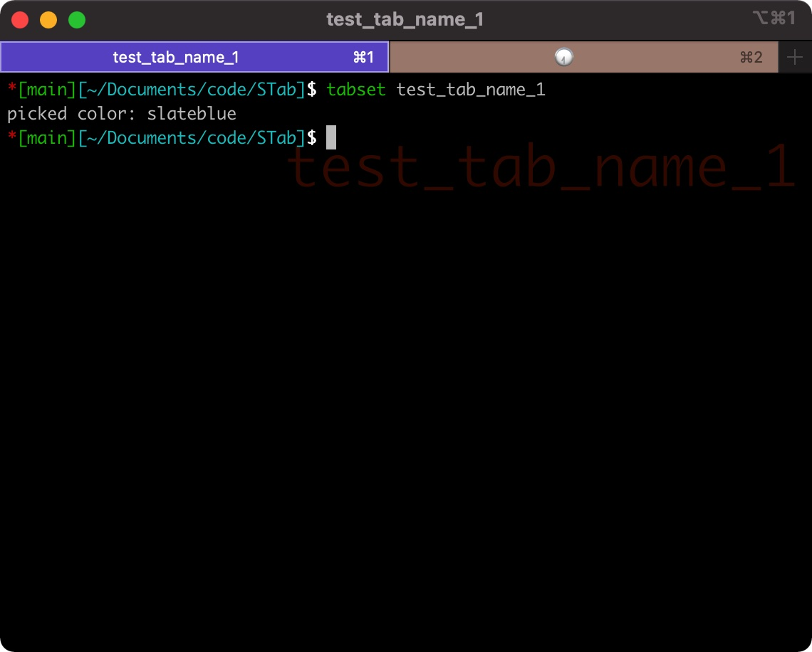
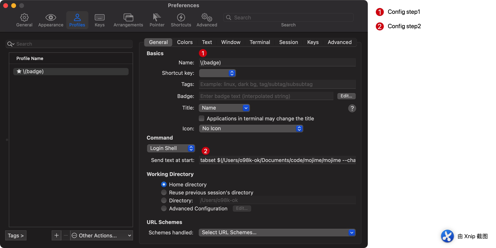
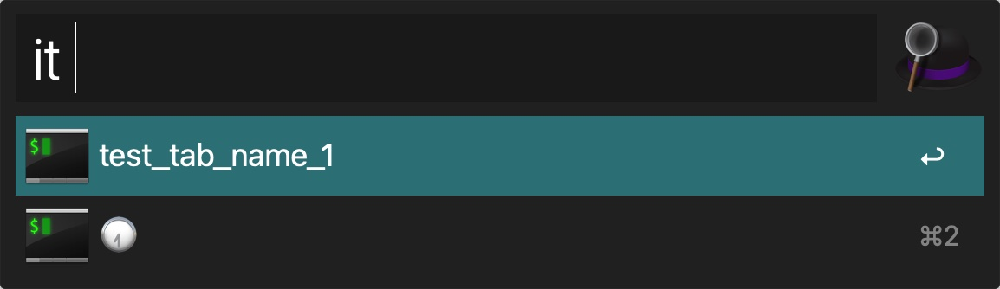

# STab
Switch Iterm2 tab

## Introduce
Simple python version for  [florianeckerstorfer/alfred-iterm2-tabs](https://github.com/florianeckerstorfer/alfred-iterm2-tabs).
Because php version has terrible cooperation with Alfred

## Installation
Download [latest](https://github.com/o98k-ok/STab/releases) version, and install it.

## TabTitle

### tabset
Here I introduce a useful tool [Tabset](https://www.npmjs.com/package/iterm2-tab-set).

```shell
# npm i iterm2-tab-set
# tabset $keyinfo
```

After running `tabset $keyinfo`, tabset will do three steps:
1. Random setting a color of tab title bar.
2. Setting tab title as $keyinfo
3. Setting tab badge as $keyinfo



### Iterm2 config
In my prictice, I pick the following configs:
1. Setting the `profile name` as `badge`. When I open a new tab, the tab' session name will be set to `badge`, in order to list and select it.
2. Setting default badge value as [a random emoji](https://github.com/JuanitoFatas/mojime). In your cases/scripts, you should set a useful info as badge.



## Custom show



## Acknowledgement
1. Thanks [florianeckerstorfer/alfred-iterm2-tabs](https://github.com/florianeckerstorfer/alfred-iterm2-tabs)
2. [Tabset](https://www.npmjs.com/package/iterm2-tab-set) may help too.
3. [Badges](https://iterm2.com/documentation-badges.html) is amazing too.
